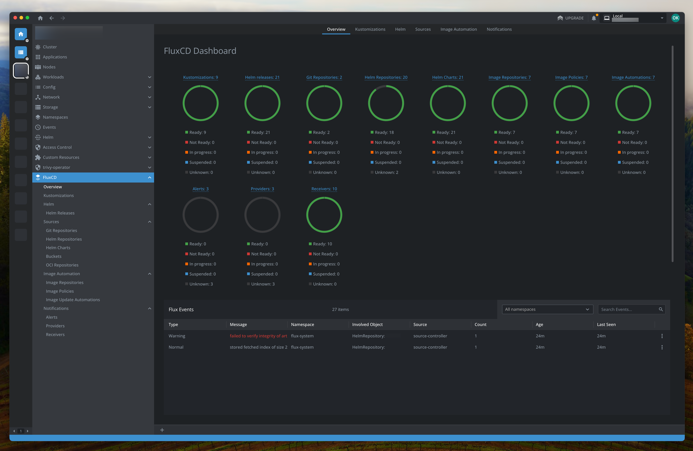

# @freelensapp/fluxcd-extension

<!-- markdownlint-disable MD013 -->

[](https://freelens.app)
[](https://github.com/freelensapp/freelens)
[](https://github.com/freelensapp/freelens-fluxcd-extension)
[](https://github.com/freelensapp/freelens-fluxcd-extension/actions/workflows/integration-tests.yaml)
[](https://www.npmjs.com/package/@freelensapp/fluxcd-extension)

<!-- markdownlint-enable MD013 -->

This extension integrates FluxCD support into
[Freelens](https://github.com/freelensapp/freelens).
[FluxCD](https://fluxcd.io/) v2.0.0 or higher is supported.

Features include:

- Comprehensive dashboard for FluxCD Application components and Events.
- Resource menus for reconciling, syncing, and automating FluxCD resources.
- Detailed views of FluxCD resource information.

## Screenshots

### Dashboard


## Requirements

- Kubernetes >= 1.24
- Freelens >= 1.6.0
- Flux >= v2.0.0, <= 2.7.x
- kustomize-controller >= v0.1.0
- helm-controller >= v0.1.0
- image-automation-controller >= v0.14.0
- image-reflector-controller >= v0.11.0
- notification-controller >= v0.1.0
- source-controller >= v0.1.0

## API supported

- [helm.toolkit.fluxcd.io/v2beta1](https://github.com/fluxcd/helm-controller/blob/v0.1.0/docs/spec/v2beta1/)
  (helm-controller)
- [helm.toolkit.fluxcd.io/v2beta2](https://github.com/fluxcd/helm-controller/tree/v1.4.2/docs/spec/v2beta2)
  (helm-controller)
- [helm.toolkit.fluxcd.io/v2](https://github.com/fluxcd/helm-controller/tree/v1.4.2/docs/spec/v2)
  (helm-controller)
- [kustomize.toolkit.fluxcd.io/v1beta1](https://github.com/fluxcd/kustomize-controller/blob/v0.1.0/docs/spec/v1beta1/)
  (kustomize-controller)
- [kustomize.toolkit.fluxcd.io/v1beta2](https://github.com/fluxcd/kustomize-controller/tree/v1.7.1/docs/spec/v1beta2)
  (kustomize-controller)
- [kustomize.toolkit.fluxcd.io/v1](https://github.com/fluxcd/kustomize-controller/tree/v1.7.1/docs/spec/v1)
  (kustomize-controller)
- [image.toolkit.fluxcd.io/v1beta1](https://github.com/fluxcd/image-automation-controller/blob/main/docs/spec/v1beta1/imageupdateautomations.md)
  (image-automation-controller)
- [image.toolkit.fluxcd.io/v1beta2](https://github.com/fluxcd/image-automation-controller/blob/main/docs/spec/v1beta2/imageupdateautomations.md)
  (image-automation-controller)
- [image.toolkit.fluxcd.io/v1](https://github.com/fluxcd/image-automation-controller/tree/v1.0.2/docs/spec/v1)
  (image-automation-controller)
- [image.toolkit.fluxcd.io/v1beta1](https://github.com/fluxcd/image-reflector-controller/blob/v0.11.0/docs/api/image-reflector.md)
  (image-reflector-controller)
- [image.toolkit.fluxcd.io/v1beta2](https://github.com/fluxcd/image-reflector-controller/blob/v0.35.2/docs/api/v1beta2/image-reflector.md)
  (image-reflector-controller)
- [image.toolkit.fluxcd.io/v1](https://github.com/fluxcd/image-reflector-controller/blob/v1.0.2/docs/api/v1/image-reflector.md)
  (image-reflector-controller)
- [notification.toolkit.fluxcd.io/v1beta1](https://github.com/fluxcd/notification-controller/blob/v0.1.0/docs/api/notification.md)
  (notification-controller)
- [notification.toolkit.fluxcd.io/v1beta2](https://github.com/fluxcd/notification-controller/blob/v1.7.3/docs/api/v1beta2/notification.md)
  (notification-controller)
- [notification.toolkit.fluxcd.io/v1beta3](https://github.com/fluxcd/notification-controller/blob/v1.7.3/docs/api/v1beta3/notification.md)
  (notification-controller)
- [notification.toolkit.fluxcd.io/v1](https://github.com/fluxcd/notification-controller/blob/v1.7.3/docs/api/v1/notification.md)
  (notification-controller)
- [source.toolkit.fluxcd.io/v1beta1](https://github.com/fluxcd/source-controller/blob/v0.1.0/docs/api/source.md)
  (source-controller)
- [source.toolkit.fluxcd.io/v1beta2](https://github.com/fluxcd/source-controller/blob/v1.7.2/docs/api/v1beta2/source.md)
  (source-controller)
- [source.toolkit.fluxcd.io/v1](https://github.com/fluxcd/source-controller/blob/v1.7.2/docs/api/v1/source.md)
  (source-controller)

## Install

To install or upgrade: open Freelens and go to Extensions (`ctrl`+`shift`+`E`
or `cmd`+`shift`+`E`), and install `@freelensapp/fluxcd-extension`.

or:

Use a following URL in the browser:
[freelens://app/extensions/install/%40freelensapp%2Ffluxcd-extension](freelens://app/extensions/install/%40freelensapp%2Ffluxcd-extension)

## Build from the source

You can build the extension using this repository.

### Prerequisites

Use [NVM](https://github.com/nvm-sh/nvm) or
[mise-en-place](https://mise.jdx.dev/) or
[windows-nvm](https://github.com/coreybutler/nvm-windows) to install the
required Node.js version.

From the root of this repository:

```sh
nvm install
# or
mise install
# or
winget install CoreyButler.NVMforWindows
nvm install 22.16.0
nvm use 22.16.0
```

Install Pnpm:

```sh
corepack install
# or
curl -fsSL https://get.pnpm.io/install.sh | sh -
# or
winget install pnpm.pnpm
```

### Build extension

```sh
pnpm i
pnpm build
pnpm pack
```

### Install built extension

The tarball for the extension will be placed in the current directory. In
Freelens, navigate to the Extensions list and provide the path to the tarball
to be loaded, or drag and drop the extension tarball into the Freelens window.
After loading for a moment, the extension should appear in the list of enabled
extensions.

## License

Copyright (c) 2025 Freelens Authors.

[MIT License](https://opensource.org/licenses/MIT)

Based on:

- <https://github.com/appvia/lens-fluxcd-extension>
- <https://github.com/okaufmann/lens-fluxcd-extension>
