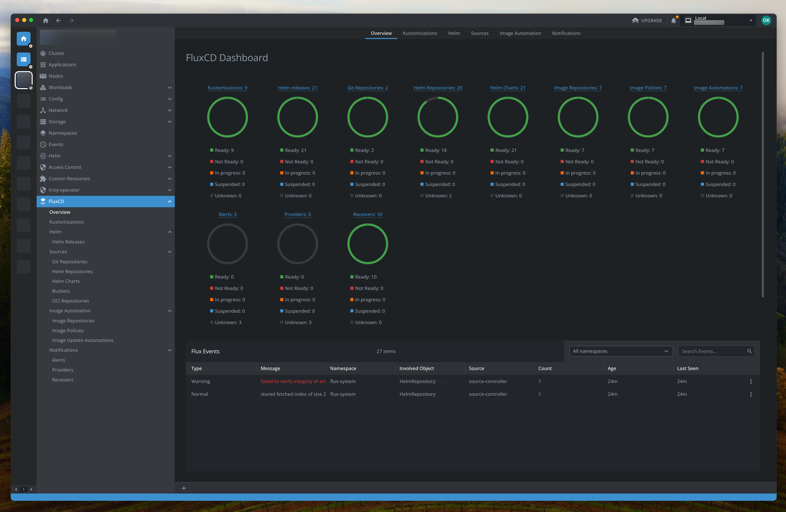

# @freelensapp/fluxcd-extension

<!-- markdownlint-disable MD013 -->

[](https://freelens.app)
[](https://github.com/freelensapp/freelens-fluxcd-extension)
[](https://github.com/freelensapp/freelens-fluxcd-extension/releases)
[](https://github.com/freelensapp/freelens-fluxcd-extension/actions/workflows/integration-tests.yaml)
[](https://www.npmjs.com/package/@freelensapp/fluxcd-extension)

<!-- markdownlint-enable MD013 -->

## Overview

This extension adds support for [FluxCD](https://fluxcd.io/) to
[Freelens](https://freelens.app). FluxCD is a set of continuous and
progressive delivery solutions for Kubernetes that keep the cluster state in
sync with sources such as Git repositories, OCI artifacts, and Helm charts.
FluxCD v2.0.0 or higher is supported.

The extension provides a dashboard, cluster pages, list views, and detail
panels for the FluxCD custom resources across the `fluxcd.controlplane.io`,
`source.toolkit.fluxcd.io`, `kustomize.toolkit.fluxcd.io`,
`helm.toolkit.fluxcd.io`, `image.toolkit.fluxcd.io`, and
`notification.toolkit.fluxcd.io` API groups. Each resource is accessible from
the Freelens sidebar, with status conditions, spec fields, and related
objects displayed in the detail view. Resource menus allow reconciling,
suspending, and resuming FluxCD resources directly from the UI.



## Requirements

- Kubernetes >= 1.24
- Freelens >= 1.6.2
- Flux >= v2.0.0, <= 2.8.x
- flux-operator >= v0.6.0
- kustomize-controller >= v0.1.0
- helm-controller >= v0.1.0
- image-automation-controller >= v0.14.0
- image-reflector-controller >= v0.11.0
- notification-controller >= v0.1.0
- source-controller >= v0.1.0

## Supported APIs

### fluxcd.controlplane.io

Resources managed by the
[flux-operator](https://github.com/controlplaneio-fluxcd/flux-operator).

<!-- markdownlint-disable MD013 -->

| API Version | Kind | Short Name | Scope | Description |
| --- | --- | --- | --- | --- |
| v1 | `FluxInstance` | | Namespaced | Manages the installation and configuration of a Flux instance |
| v1 | `FluxReport` | | Namespaced | Reports the status and health of a Flux installation |
| v1 | `ResourceSet` | `rset` | Namespaced | Group of Kubernetes resources managed as a single unit |
| v1 | `ResourceSetInputProvider` | `rsip` | Namespaced | Provides inputs for `ResourceSet` templating |

<!-- markdownlint-enable MD013 -->

### source.toolkit.fluxcd.io

Resources managed by the
[source-controller](https://github.com/fluxcd/source-controller).

<!-- markdownlint-disable MD013 -->

| API Version | Kind | Short Name | Scope | Description |
| --- | --- | --- | --- | --- |
| v1beta1, v1beta2, v1 | `GitRepository` | `gitrepo` | Namespaced | Defines a Git repository as a source |
| v1beta2, v1 | `OCIRepository` | `ocirepo` | Namespaced | Defines an OCI artifact repository as a source |
| v1beta1, v1beta2, v1 | `HelmRepository` | `helmrepo` | Namespaced | Defines a Helm chart repository as a source |
| v1beta1, v1beta2, v1 | `HelmChart` | `hc` | Namespaced | Defines a Helm chart produced from a source |
| v1beta1, v1beta2, v1 | `Bucket` | | Namespaced | Defines an S3-compatible bucket as a source |

<!-- markdownlint-enable MD013 -->

### kustomize.toolkit.fluxcd.io

Resources managed by the
[kustomize-controller](https://github.com/fluxcd/kustomize-controller).

<!-- markdownlint-disable MD013 -->

| API Version | Kind | Short Name | Scope | Description |
| --- | --- | --- | --- | --- |
| v1beta1, v1beta2, v1 | `Kustomization` | `ks` | Namespaced | Builds and applies Kustomize overlays from a source |

<!-- markdownlint-enable MD013 -->

### helm.toolkit.fluxcd.io

Resources managed by the
[helm-controller](https://github.com/fluxcd/helm-controller).

<!-- markdownlint-disable MD013 -->

| API Version | Kind | Short Name | Scope | Description |
| --- | --- | --- | --- | --- |
| v2beta1, v2beta2, v2 | `HelmRelease` | `hr` | Namespaced | Manages a Helm release built from a chart source |

<!-- markdownlint-enable MD013 -->

### image.toolkit.fluxcd.io

Resources managed by the
[image-reflector-controller](https://github.com/fluxcd/image-reflector-controller)
and
[image-automation-controller](https://github.com/fluxcd/image-automation-controller).

<!-- markdownlint-disable MD013 -->

| API Version | Kind | Short Name | Scope | Description |
| --- | --- | --- | --- | --- |
| v1beta1, v1beta2, v1 | `ImageRepository` | | Namespaced | Scans a container image repository for tags |
| v1beta1, v1beta2, v1 | `ImagePolicy` | | Namespaced | Selects the latest image based on a policy |
| v1beta1, v1beta2, v1 | `ImageUpdateAutomation` | | Namespaced | Automates image updates committed back to Git |

<!-- markdownlint-enable MD013 -->

### notification.toolkit.fluxcd.io

Resources managed by the
[notification-controller](https://github.com/fluxcd/notification-controller).

<!-- markdownlint-disable MD013 -->

| API Version | Kind | Short Name | Scope | Description |
| --- | --- | --- | --- | --- |
| v1beta1, v1beta2, v1beta3 | `Provider` | | Namespaced | Represents a notification or event provider |
| v1beta1, v1beta2, v1beta3 | `Alert` | | Namespaced | Configures events dispatched to a `Provider` |
| v1beta1, v1beta2, v1beta3, v1 | `Receiver` | | Namespaced | Defines a webhook receiver to trigger reconciliation |

<!-- markdownlint-enable MD013 -->

## Install

To install, open Freelens and go to Extensions (`ctrl`+`shift`+`E` or `cmd`+`shift`+`E`),
then search for and install `@freelensapp/fluxcd-extension`.

Alternatively, open the following URL in the browser to install directly:

[freelens://app/extensions/install/%40freelensapp%2Ffluxcd-extension](freelens://app/extensions/install/%40freelensapp%2Ffluxcd-extension)

### Migrating from `@freelensapp/extension-fluxcd`

The package was renamed from `@freelensapp/extension-fluxcd` to
`@freelensapp/fluxcd-extension` starting with v4.0.0.

If you have the old package installed, you will not receive updates and may
encounter issues with newer Flux versions (e.g., Flux 2.7+ which removed
v1beta1 APIs).

To migrate:

1. Open Freelens Extensions (`ctrl`+`shift`+`E` or `cmd`+`shift`+`E`)
2. Uninstall `@freelensapp/extension-fluxcd` (the old package)
3. Install `@freelensapp/fluxcd-extension` (the new package)

## Build from the source

You can build the extension from this repository.

### Prerequisites

Use [NVM](https://github.com/nvm-sh/nvm),
[mise-en-place](https://mise.jdx.dev/), or
[windows-nvm](https://github.com/coreybutler/nvm-windows) to install the
required Node.js version.

From the root of this repository:

```sh
nvm install
# or
mise install
# or
winget install CoreyButler.NVMforWindows
nvm install 24.15.0
nvm use 24.15.0
```

Install pnpm:

```sh
corepack install
# or
curl -fsSL https://get.pnpm.io/install.sh | sh -
# or
winget install pnpm.pnpm
```

### Build extension

```sh
pnpm i
pnpm build
pnpm pack
```

One script to build and pack the extension for testing:

```sh
pnpm pack:dev
```

### Install built extension

The tarball will be placed in the current directory. In Freelens, navigate
to the Extensions page and provide the path to the tarball, or drag and
drop the `.tgz` file into the Freelens window.

### Check code statically

```sh
pnpm lint:check
```

or

```sh
pnpm trunk:check
```

and

```sh
pnpm build
pnpm knip:check
```

### Testing the extension with unpublished Freelens

In the Freelens working repository:

```sh
rm -f *.tgz
pnpm i
pnpm build
pnpm pack -r
```

Then in the extension repository:

```sh
echo "overrides:" >> pnpm-workspace.yaml
for i in ../freelens/*.tgz; do
  name=$(tar zxOf $i package/package.json | yq -r .name)
  echo "  \"$name\": $i" >> pnpm-workspace.yaml
done

pnpm clean:node_modules
pnpm build
```

## License

Copyright (c) 2025-2026 Freelens Authors.

[MIT License](https://opensource.org/licenses/MIT)

Based on:

- <https://github.com/appvia/lens-fluxcd-extension>
- <https://github.com/okaufmann/lens-fluxcd-extension>
</content>
</invoke>
