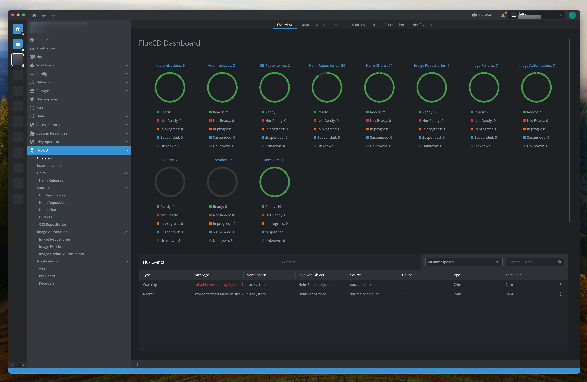

# @freelensapp/fluxcd-extension

<!-- markdownlint-disable MD013 -->

[](https://freelens.app)
[](https://github.com/freelensapp/freelens-fluxcd-extension)
[](https://github.com/freelensapp/freelens-fluxcd-extension/releases)
[](https://github.com/freelensapp/freelens-fluxcd-extension/actions/workflows/integration-tests.yaml)
[](https://www.npmjs.com/package/@freelensapp/fluxcd-extension)

<!-- markdownlint-enable MD013 -->

## Overview

This extension adds support for [FluxCD](https://fluxcd.io/) to
[Freelens](https://freelens.app). FluxCD is a set of continuous and
progressive delivery solutions for Kubernetes that keep the cluster state in
sync with sources such as Git repositories, OCI artifacts, and Helm charts.
FluxCD v2.0.0 or higher is supported.

The extension provides a dashboard, cluster pages, list views, and detail
panels for the FluxCD custom resources across the `fluxcd.controlplane.io`,
`source.toolkit.fluxcd.io`, `kustomize.toolkit.fluxcd.io`,
`helm.toolkit.fluxcd.io`, `image.toolkit.fluxcd.io`, and
`notification.toolkit.fluxcd.io` API groups. Each resource is accessible from
the Freelens sidebar, with status conditions, spec fields, and related
objects displayed in the detail view. Resource menus allow reconciling,
suspending, and resuming FluxCD resources directly from the UI.



## Requirements

- Kubernetes >= 1.24
- Freelens >= 2.0.0 (for Freelens 1.x, use a 5.x release of this extension)
- Flux >= v2.0.0, <= 2.8.x
- flux-operator >= v0.6.0
- kustomize-controller >= v0.1.0
- helm-controller >= v0.1.0
- image-automation-controller >= v0.14.0
- image-reflector-controller >= v0.11.0
- notification-controller >= v0.1.0
- source-controller >= v0.1.0

## Supported APIs

### fluxcd.controlplane.io

Resources managed by the
[flux-operator](https://github.com/controlplaneio-fluxcd/flux-operator).

<!-- markdownlint-disable MD013 -->

| API Version | Kind | Short Name | Scope | Description |
| --- | --- | --- | --- | --- |
| v1 | `FluxInstance` | | Namespaced | Manages the installation and configuration of a Flux instance |
| v1 | `FluxReport` | | Namespaced | Reports the status and health of a Flux installation |
| v1 | `ResourceSet` | `rset` | Namespaced | Group of Kubernetes resources managed as a single unit |
| v1 | `ResourceSetInputProvider` | `rsip` | Namespaced | Provides inputs for `ResourceSet` templating |

<!-- markdownlint-enable MD013 -->

### source.toolkit.fluxcd.io

Resources managed by the
[source-controller](https://github.com/fluxcd/source-controller).

<!-- markdownlint-disable MD013 -->

| API Version | Kind | Short Name | Scope | Description |
| --- | --- | --- | --- | --- |
| v1beta1, v1beta2, v1 | `GitRepository` | `gitrepo` | Namespaced | Defines a Git repository as a source |
| v1beta2, v1 | `OCIRepository` | `ocirepo` | Namespaced | Defines an OCI artifact repository as a source |
| v1beta1, v1beta2, v1 | `HelmRepository` | `helmrepo` | Namespaced | Defines a Helm chart repository as a source |
| v1beta1, v1beta2, v1 | `HelmChart` | `hc` | Namespaced | Defines a Helm chart produced from a source |
| v1beta1, v1beta2, v1 | `Bucket` | | Namespaced | Defines an S3-compatible bucket as a source |

<!-- markdownlint-enable MD013 -->

### kustomize.toolkit.fluxcd.io

Resources managed by the
[kustomize-controller](https://github.com/fluxcd/kustomize-controller).

<!-- markdownlint-disable MD013 -->

| API Version | Kind | Short Name | Scope | Description |
| --- | --- | --- | --- | --- |
| v1beta1, v1beta2, v1 | `Kustomization` | `ks` | Namespaced | Builds and applies Kustomize overlays from a source |

<!-- markdownlint-enable MD013 -->

### helm.toolkit.fluxcd.io

Resources managed by the
[helm-controller](https://github.com/fluxcd/helm-controller).

<!-- markdownlint-disable MD013 -->

| API Version | Kind | Short Name | Scope | Description |
| --- | --- | --- | --- | --- |
| v2beta1, v2beta2, v2 | `HelmRelease` | `hr` | Namespaced | Manages a Helm release built from a chart source |

<!-- markdownlint-enable MD013 -->

### image.toolkit.fluxcd.io

Resources managed by the
[image-reflector-controller](https://github.com/fluxcd/image-reflector-controller)
and
[image-automation-controller](https://github.com/fluxcd/image-automation-controller).

<!-- markdownlint-disable MD013 -->

| API Version | Kind | Short Name | Scope | Description |
| --- | --- | --- | --- | --- |
| v1beta1, v1beta2, v1 | `ImageRepository` | | Namespaced | Scans a container image repository for tags |
| v1beta1, v1beta2, v1 | `ImagePolicy` | | Namespaced | Selects the latest image based on a policy |
| v1beta1, v1beta2, v1 | `ImageUpdateAutomation` | | Namespaced | Automates image updates committed back to Git |

<!-- markdownlint-enable MD013 -->

### notification.toolkit.fluxcd.io

Resources managed by the
[notification-controller](https://github.com/fluxcd/notification-controller).

<!-- markdownlint-disable MD013 -->

| API Version | Kind | Short Name | Scope | Description |
| --- | --- | --- | --- | --- |
| v1beta1, v1beta2, v1beta3 | `Provider` | | Namespaced | Represents a notification or event provider |
| v1beta1, v1beta2, v1beta3 | `Alert` | | Namespaced | Configures events dispatched to a `Provider` |
| v1beta1, v1beta2, v1beta3, v1 | `Receiver` | | Namespaced | Defines a webhook receiver to trigger reconciliation |

<!-- markdownlint-enable MD013 -->

## Install

Open Freelens and go to Extensions (`ctrl`+`shift`+`E` or
`cmd`+`shift`+`E`). The field at the top takes a package name, the URL of a
tarball, or the path to a tarball or a directory.

### From the registry

Enter `@freelensapp/fluxcd-extension` and press Install.

Alternatively, open the following URL in the browser to install directly:

[freelens://app/extensions/install/%40freelensapp%2Ffluxcd-extension](freelens://app/extensions/install/%40freelensapp%2Ffluxcd-extension)

### From a release tarball

Each [release](https://github.com/freelensapp/freelens-fluxcd-extension/releases)
has the extension as `freelensapp-fluxcd-extension-<version>.tgz`, with its
checksum in `freelensapp-fluxcd-extension-<version>.tgz.sha256`. Use a 6.x or
later release with Freelens 2.x, and a 5.x release with Freelens 1.x.

- Enter the URL of the `.tgz` asset and press Install. Freelens downloads the
  `.tgz.sha256` next to it and checks the tarball against it.
- Or download both files into one directory and enter the path to the `.tgz`,
  or drop the `.tgz` on the Freelens window. Freelens checks it against the
  `.tgz.sha256` next to it.

### From a directory

Build the extension (see below), then enter the path to your checkout, the
directory with `package.json`, and press Install. Freelens runs the extension
from that directory, from the files in `dist/`, and lists it as unverified.
This is how you work on the extension: see
[Development loop](#development-loop).

### Migrating from `@freelensapp/extension-fluxcd`

The package was renamed from `@freelensapp/extension-fluxcd` to
`@freelensapp/fluxcd-extension` starting with v4.0.0.

If you have the old package installed, you will not receive updates and may
encounter issues with newer Flux versions (e.g., Flux 2.7+ which removed
v1beta1 APIs).

To migrate:

1. Open Freelens Extensions (`ctrl`+`shift`+`E` or `cmd`+`shift`+`E`)
2. Uninstall `@freelensapp/extension-fluxcd` (the old package)
3. Install `@freelensapp/fluxcd-extension` (the new package)

## Build from the source

You can build the extension from this repository.

### Prerequisites

Use [NVM](https://github.com/nvm-sh/nvm),
[mise-en-place](https://mise.jdx.dev/), or
[windows-nvm](https://github.com/coreybutler/nvm-windows) to install the
Node.js version in `.nvmrc`.

From the root of this repository:

```sh
nvm install
# or
mise install
# or
winget install CoreyButler.NVMforWindows
nvm install "$(cat .nvmrc)"
nvm use "$(cat .nvmrc)"
```

Install pnpm:

```sh
corepack install
# or
curl -fsSL https://get.pnpm.io/install.sh | sh -
# or
winget install pnpm.pnpm
```

### Build extension

```sh
pnpm install
pnpm build
```

The extension is built into `dist/`. To pack it into a tarball:

```sh
pnpm pack
```

One script to bump the prerelease version, build and pack the extension for
testing:

```sh
pnpm pack:dev
```

The tarball is placed in the current directory. Install it as described in
[From a release tarball](#from-a-release-tarball).

### Development loop

Install the extension from your checkout once, as described in
[From a directory](#from-a-directory), then run:

```sh
pnpm dev
```

It rebuilds the extension whenever a source file changes, and Freelens
reloads the extension after each rebuild, without a restart and without
packing. Stop it with `ctrl`+`C`.

Neither `pnpm build` nor `pnpm dev` type-checks; run `pnpm type:check` for
that. A change to `main` or `renderer` in `package.json` needs Freelens
restarted once.

To check the extension in Freelens with an AI agent, see "Checking the
Extension in Freelens Dev" in [AGENTS.md](AGENTS.md).

### Check the code

```sh
pnpm type:check
pnpm test:unit
pnpm lint:check
pnpm knip:check
```

and, for the formats that Biome does not cover:

```sh
pnpm trunk:check
```

### Testing the extension with unpublished Freelens

In the Freelens working repository:

```sh
rm -f *.tgz
pnpm i
pnpm build
pnpm pack -r
```

Then in the extension repository:

```sh
echo "overrides:" >> pnpm-workspace.yaml
for i in ../freelens/*.tgz; do
  name=$(tar zxOf $i package/package.json | yq -r .name)
  echo "  \"$name\": $i" >> pnpm-workspace.yaml
done

pnpm clean:node_modules
pnpm build
```

## License

Copyright (c) 2025-2026 Freelens Authors.

[MIT License](https://opensource.org/licenses/MIT)

Based on:

- <https://github.com/appvia/lens-fluxcd-extension>
- <https://github.com/okaufmann/lens-fluxcd-extension>
</content>
</invoke>
